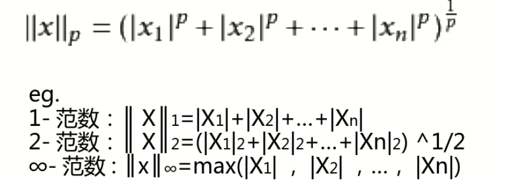

# Spark-machine-learning
使用Scala操作spark进行机器学习

## Spark-Shell

- Sparkshell是一个bash脚本，在./bin目录下 
- Sparkshell为我们事先配置好了上下 文(context)和会话(session)

## Spark 实现wordcount
配置spark，需要加入spark的jar和scala-sdk

[wordCount生成](./src/WordCount.scala)

## Spark 的矩阵和向量

### Spark矩阵

- 按照长方阵列排列的实数或复数的集合 
- 矩阵在程序中以二维数组的形式存储，可以认为是一个二维表

### Spark 向量

#### p 范数

[矩阵](./src/Matrix.scala)

[向量](./src/Vector.scala)

## 基本统计模块
- Spark的基础统计模块即MLlib组件中的BasicStatistics部分 
- BasicStatistics主要包括CorreIation与Hypothesistesting等 
- 多被封装在org.apache.spark.mllib.stat._中

