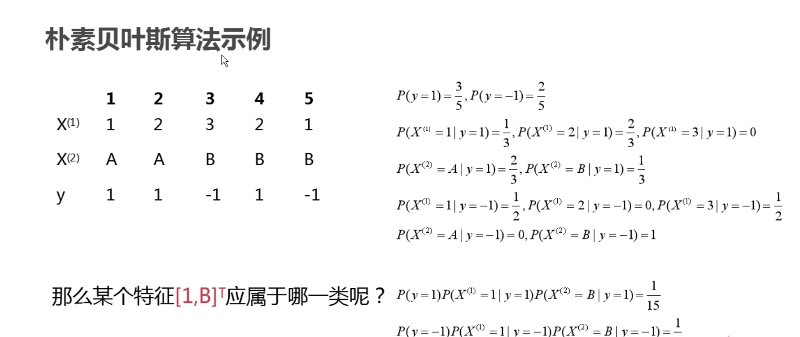
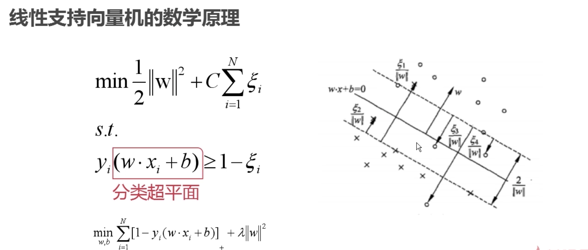
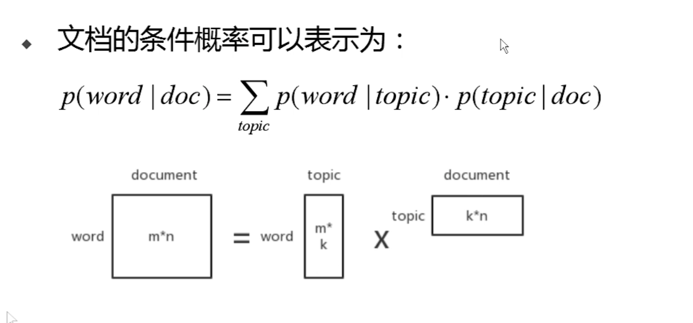
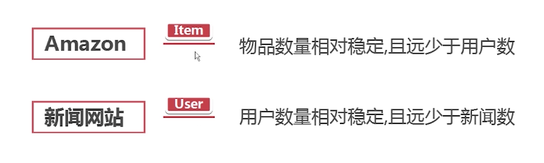

# Spark-machine-learning
使用Scala操作spark进行机器学习

## Spark-Shell

- Sparkshell是一个bash脚本，在./bin目录下 
- Sparkshell为我们事先配置好了上下 文(context)和会话(session)

## Spark 实现wordcount
配置spark，需要加入spark的jar和scala-sdk

[wordCount生成](./src/WordCount.scala)

## Spark 的矩阵和向量

### Spark矩阵

- 按照长方阵列排列的实数或复数的集合 
- 矩阵在程序中以二维数组的形式存储，可以认为是一个二维表

### Spark 向量

#### p 范数

[矩阵](./src/Matrix.scala)

[向量](./src/Vector.scala)

## 基本统计模块
- Spark的基础统计模块即MLlib组件中的BasicStatistics部分 
- BasicStatistics主要包括CorreIation与Hypothesistesting等 
- 多被封装在org.apache.spark.mllib.stat._中

[分析数据](./src/dataAnalyse.scala)

[分析相关](./src/cor_test.scala)

### 检验
根据一定假设条件，由样本推断总体的一种统计学方法。基本思路 是先提出假设（虚无假设〗使用统计学方法进行计算，根据计算结果 判断是否拒绝假设

- 皮尔森卡方检验 
    - 皮尔森卡方检验是最常用的卡方检验，可以分为适配度检验和独立性检验 
    - 适配度检验：验证观察值的次数分酉芑与理论值是否相等
    - 独立性检验
[卡方检验](./src/chi2_test.scala)

# 机器学习算法
## 回归算法

- 回归与分类类似，只不过回归的预测结果是连续的，而分类的预测 结果是离散的。

- 这样，也就使得很多回归与分类的模型可以经过改动而通用 
- 正因如此，对于回归和分类中基本原理相同或类似的模型，我们不 再具体讲解

- 最小二乘法又称最小平方法，通过最小化残差平方和来找到最佳的函数匹配 也就是说，最小二乘法以残差的平方和作为损失函数，用于衡量模型的好坏

### scala 版本的问题、

[线性回归](./src/LR.scala)

[逻辑回归](./src/LR.scala)

### isotonic Regression
- 保序回归是用于拟合非递减数据（非递增也一样）的一种回归分析，同时保序回归能够使得拟合之后的误差最小化
- 保序回归用于拟合非递减娄居不需要事先判断线性与否，只需数据总体的趋势是递减的即可。例如研究某种药物的用剂量与药效之间的关系
Spark实现求解该模型的算法是pool adjacent violators算法 (PAVA)

[包序回归](./src/isotonic.scala)

## 分类
- 朴素贝叶斯

[朴素贝叶斯](./src/naive_bayes.scala)

- SVM
    - 基于硬间隔最大化的线性可分支持向量机 
    - 基于软间隔最大化的线性支持向量机 
    - 使用核函数的非线性支持向量机

[支持向量机](./src/SVM.scala)

### 决策树
- spark 使用ID3 决策树实现

[决策树1](./src/DecisionTree.scala)
   
[决策树2](./src/DT2.scala)

## Spark 聚类算法

- Kmeans 算法

[kmeans](./src/kmeans.scala)

- LDA 算法
 
    - LDA即文档主题生成模型，该算法是一种无监督学习 
    - 将主题对应聚类中心，文档作为样本，则LDA也是一种聚类算法
    

[kmeans](./src/LDA.scala)

## PCA 

[PCA](./src/PCA.scala)

## 文本情感分类

- 基于TF-IDF + naive - bayes

[Sentiment](./src/Sentiment.scala)

## 推荐系统

### 什么是协同过滤算法？ 
根据用户对物品或者信息的偏好，发现物品或者内容本身的相关性，或者是发现用户的相关性，然后再基于这些关联性进行推荐。 
基于协同过滤的推荐可以分为三个子类
- 基于用户的推荐（User-based）

    根据所有用户对物品或者信息的偏好，发现与当前用户 偏好相似的"邻居"用户群，基于周围k个邻居的历史 偏好信息，为当前用户进行推荐。 

- 基于项目的准荐（ltem-based） 

    使用所有用户对物品或者信息的偏好，发现物品和物品 之间的相似度，然后根据用户的历史偏好信息，将类似的物品推荐给用户

- 基于模型的推荐（Model-based）

