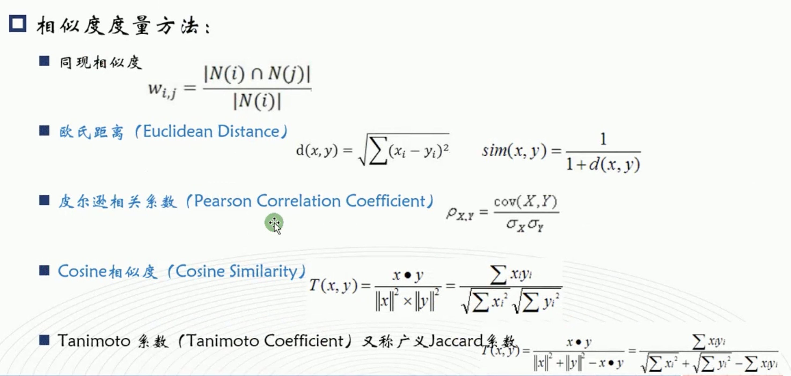

# Spark-machine-learning
使用Scala操作spark进行机器学习

## Spark-Shell

- Sparkshell是一个bash脚本，在./bin目录下 
- Sparkshell为我们事先配置好了上下 文(context)和会话(session)

## Spark 实现wordcount
配置spark，需要加入spark的jar和scala-sdk

[wordCount生成](./src/WordCount.scala)

## Spark 的矩阵和向量

### Spark矩阵

- 按照长方阵列排列的实数或复数的集合 
- 矩阵在程序中以二维数组的形式存储，可以认为是一个二维表

### Spark 向量

#### p 范数

[矩阵](./src/Matrix.scala)

[向量](./src/Vector.scala)

## 基本统计模块
- Spark的基础统计模块即MLlib组件中的BasicStatistics部分 
- BasicStatistics主要包括CorreIation与Hypothesistesting等 
- 多被封装在org.apache.spark.mllib.stat._中

[分析数据](./src/dataAnalyse.scala)

[分析相关](./src/cor_test.scala)

### 检验
根据一定假设条件，由样本推断总体的一种统计学方法。基本思路 是先提出假设（虚无假设〗使用统计学方法进行计算，根据计算结果 判断是否拒绝假设

- 皮尔森卡方检验 
    - 皮尔森卡方检验是最常用的卡方检验，可以分为适配度检验和独立性检验 
    - 适配度检验：验证观察值的次数分酉芑与理论值是否相等
    - 独立性检验
[卡方检验](./src/chi2_test.scala)

# 机器学习算法
## 回归算法

- 回归与分类类似，只不过回归的预测结果是连续的，而分类的预测 结果是离散的。

- 这样，也就使得很多回归与分类的模型可以经过改动而通用 
- 正因如此，对于回归和分类中基本原理相同或类似的模型，我们不 再具体讲解

- 最小二乘法又称最小平方法，通过最小化残差平方和来找到最佳的函数匹配 也就是说，最小二乘法以残差的平方和作为损失函数，用于衡量模型的好坏

### scala 版本的问题、

[线性回归](./src/LR.scala)

[逻辑回归](./src/LR.scala)

### isotonic Regression
- 保序回归是用于拟合非递减数据（非递增也一样）的一种回归分析，同时保序回归能够使得拟合之后的误差最小化
- 保序回归用于拟合非递减娄居不需要事先判断线性与否，只需数据总体的趋势是递减的即可。例如研究某种药物的用剂量与药效之间的关系
Spark实现求解该模型的算法是pool adjacent violators算法 (PAVA)

[包序回归](./src/isotonic.scala)

## 分类
- 朴素贝叶斯

[朴素贝叶斯](./src/naive_bayes.scala)

- SVM
    - 基于硬间隔最大化的线性可分支持向量机 
    - 基于软间隔最大化的线性支持向量机 
    - 使用核函数的非线性支持向量机

[支持向量机](./src/SVM.scala)

### 决策树
- spark 使用ID3 决策树实现

[决策树1](./src/DecisionTree.scala)
   
[决策树2](./src/DT2.scala)

## Spark 聚类算法

- Kmeans 算法

[kmeans](./src/kmeans.scala)

- LDA 算法
 
    - LDA即文档主题生成模型，该算法是一种无监督学习 
    - 将主题对应聚类中心，文档作为样本，则LDA也是一种聚类算法
    

[kmeans](./src/LDA.scala)

## PCA 

[PCA](./src/PCA.scala)

## 文本情感分类

- 基于TF-IDF + naive - bayes

[Sentiment](./src/Sentiment.scala)

## 推荐系统

### 什么是协同过滤算法？ 
根据用户对物品或者信息的偏好，发现物品或者内容本身的相关性，或者是发现用户的相关性，然后再基于这些关联性进行推荐。 
基于协同过滤的推荐可以分为三个子类
- 基于用户的推荐（User-based）

    根据所有用户对物品或者信息的偏好，发现与当前用户 偏好相似的"邻居"用户群，基于周围k个邻居的历史 偏好信息，为当前用户进行推荐。 

- 基于项目的准荐（ltem-based） 

    使用所有用户对物品或者信息的偏好，发现物品和物品 之间的相似度，然后根据用户的历史偏好信息，将类似的物品推荐给用户

- 基于模型的推荐（Model-based）

[推荐系统ALS](./src/ALS.scala)

## Spark 实战项目

        
    Spark MLlib（机器学习库）
        使用Spark框架将常见机器学习算法实现，以供使用，类似Python语言中机器学习库sk-learn。
    -1. 提供API以供使用
        从Spark 2.0开始 官方推荐使用基于DataFrame API算法库
        -a. 基于RDD实现算法库
            org.apache.spark.mllib
            http://spark.apache.org/docs/2.2.0/mllib-guide.html#mllib-rdd-based-api
        -b. 基于DataFrame实现算法库
            org.apache.spark.ml
            http://spark.apache.org/docs/2.2.0/ml-guide.html
    
    -2. 机器学习算法
        -a. 代码-理论-代码
        -b. 算法分类（十大经典机器学习算法）
            物以类聚，人以群分
            -i. 分类算法Classification  - 预测类别，离散值
                -a. 决策树
                    DecisionTree
                -b. 逻辑回归
                    LogisticRegression
                -c. 支持向量机
                    SVM
                -d. 朴素贝叶斯
                    NaiveBayes
                应用：
                    垃圾邮件分类
                    广告是否点击
            -ii. 回归算法Regression  - 预测连续值
                -a. 决策树
                    DecisionTree
                -b. 线性回归
                    LinearRegression：
                        L1正则化 -> Lasso
                        L2正则化 -> RidgeRegression
                应用:
                    预测某日共享单车出租次数
                    预测某个时间订单量
                    预测某天天气气温
            -iii. 聚类算法Clustering
                K-Means（K-均值算法）
            -iv. 推荐算法（Collaborative filtering）
                -a. 协同过滤算法
                    ALS（最小交替二乘法）
                        Alternating Least Squares
                -b. 关联规则算法（购物篮算法）
                    AssociationRules
                    FPGrowth
            -v. 集成Ensemble学习算法（融合学习算法）
                多个模型进行预测，“合并”预测的结果
                -a. 随机森林算法（Random Forests）
                    N 棵树
                -b. 梯度提升算法（Gradient-Boosted Trees）
                    底层RF
                    
## 推荐系统
    推荐引擎：
        通过探寻不同物品（产品Item、Product）或者不同用户之间喜好的联系，用于预测用户喜好的物品。
    
    以亚马逊图书推荐为例：
        Spark机器学习 
            -a. 推荐一： 1 Product
                经常一起购买的商品
            -b. 推荐二： 5 * 12 = 60 Product
                浏览此商品的顾客也同时浏览
            -c. 推荐三： 5 * 20 = 100 Product
                购买此商品的顾客也同时购买
        
    以JD商品推荐为例：
        樱桃（Cherry）MX-Board 2.0 G80-3801机械键盘
            -a. 推荐一：人气配件
                购买此Product同时购买Product
            -b. 推荐二：针对不同配件
                推荐TopKey个Product
            -c. 推荐三：达人选购
                购买最多类似Product，推荐
            -d. 推荐四：看了又看
                同时浏览的类似Product
            -e. 推荐五：键盘热销榜
                同价位、同品牌、总排行
                
    推荐系统的核心：
         产品（商品Product、Item）
         系统：产生记录用户行为数据（浏览数据和购买数据）
         算法：推荐系统算法和分类、回归与聚类算法
         
    推荐系统组成：
        数据
        算法（online在线&offline离线)
        Message System -> KAFKA
        Search	engine
        NoSQL -> HBase、Redis
        分布式计算 -> Spark 
        效果评测 -> 购买量，销售额 是否增加
        
    协同过滤推荐算法CF：
        思想：
            通过观察所有用户User给产品Product/Item的评价Rating来判断每个用户的喜好Favorite
        功能：
            -1. 针对用户来说（User-CF）：
                推荐哪些电影给用户，你喜欢呢？你会观看哪些？
            -2. 针对电影来说（Item-CF）：
                推荐给哪些用户？哪些用户会喜欢？
                
    用户对产品的评价（评分）Rating：
         -a. 显示评价（评分） ， 分数越高，喜好程度越高
             淘票票购买电影票，观看电影以后，直接评分
             使用滴滴打车付款以后，直接评分
             评分是最直接和最直观
         -b. 隐式评价（评分），次数越多，某种程度上说，喜好程度越高
             针对网易音乐网站来数，听某首歌曲的次数
             某个网站某类上的浏览次数
             网站点击量、视频播放数、音乐收藏数
             
